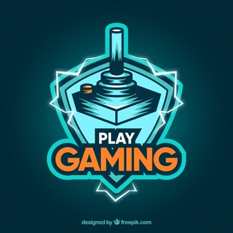

# cracked_games
<html>

<body>
<link rel="profile" href="ok.png">
<link rel="pingback" href="ok.png">
<link rel="shortcut icon" href="ok.png">
<title>cracked games</title>

<meta name="description" content="Hier findest du unsere aktuellen YouTube-Partner und deren YouTube-Kanäle.">
<link rel="canonical" href="ok.png">
<meta property="og:locale" content="de_DE">
<meta property="og:type" content="article">
<meta property="og:title" content="YouTube-Partner | Aktuelle Partner von CRACKED-GAMES.CC">
<meta property="og:description" content="Hier findest du unsere aktuellen YouTube-Partner und deren YouTube-Kanäle.">
<meta property="og:url" content="ok.png">
<meta property="og:site_name" content="ok.png">
<meta property="article:publisher" content="https://www.facebook.com/hachkpubg/?epa=SEARCH_BOX">
<meta name="twitter:card" content="summary">
<meta name="twitter:description" content="Hier findest du unsere aktuellen YouTube-Partner und deren YouTube-Kanäle.">
<meta name="twitter:title" content="YouTube-Partner | Aktuelle Partner von CRACKED-GAMES.CC">
<meta name="twitter:site" content="@cracked_gaames">
<meta name="twitter:image" content="https://yt3.ggpht.com/a-/AN66SAzbcyicL5rx4cyGJkQX5OKcjD7rWZuAePSvEA=s288-mo-c-c0xffffffff-rj-k-no">
<meta name="twitter:creator" content="@cracked_gaames">

<link rel="amphtml" href="https://cracked-games.org/partner/amp/"><link rel="dns-prefetch" href="//s.w.org">
<link rel="alternate" type="application/rss+xml" title="ok.png » Feed" href="https://cracked-games.org/feed/">
<link rel="alternate" type="application/rss+xml" title="ok.png » Kommentar-Feed" href="ok.png">

<link rel="stylesheet" id="wp-block-library-css" href="https://cracked-games.org/wp-includes/css/dist/block-library/style.min.css?ver=5.1" type="text/css" media="all">
<link rel="stylesheet" id="widgetopts-styles-css" href="ok.png" type="text/css" media="all">
<link rel="stylesheet" id="youplay-css" href="https://cracked-games.org/wp-content/themes/youplay/style.css?ver=3.6.3" type="text/css" media="all">
<link rel="stylesheet" id="bootstrap-css" href="https://cracked-games.org/wp-content/themes/youplay/assets/vendor/bootstrap/dist/css/bootstrap.min.css?ver=3.3.7" type="text/css" media="all">
<link rel="stylesheet" id="magnific-popup-css" href="https://cracked-games.org/wp-content/themes/youplay/assets/vendor/magnific-popup/dist/magnific-popup.css?ver=1.1.0" type="text/css" media="all">
<link rel="stylesheet" id="flickity-css" href="https://cracked-games.org/wp-content/themes/youplay/assets/vendor/flickity/dist/flickity.min.css?ver=2.1.1" type="text/css" media="all">
<link rel="stylesheet" id="youplay-custom-css" href="https://cracked-games.org/wp-content/uploads/nk-custom-styles/youplay-custom.min.css?ver=1534105716" type="text/css" media="all">

<link rel="stylesheet" id="js_composer_front-css" href="https://cracked-games.org/wp-content/plugins/js_composer/assets/css/js_composer.min.css?ver=5.6" type="text/css" media="all">
<link rel="stylesheet" id="youplay-child-css" href="https://cracked-games.org/wp-content/themes/youplay-child/style.css?ver=5.1" type="text/css" media="all">

<link rel="https://api.w.org/" href="https://cracked-games.org/wp-json/">
<link rel="EditURI" type="application/rsd+xml" title="RSD" href="https://cracked-games.org/xmlrpc.php?rsd">
<link rel="wlwmanifest" type="application/wlwmanifest+xml" href="https://cracked-games.org/wp-includes/wlwmanifest.xml">
<meta name="generator" content="WordPress 5.1">
<link rel="shortlink" href="https://cracked-games.org/?p=5603">
<link rel="alternate" type="application/json+oembed" href="https://cracked-games.org/wp-json/oembed/1.0/embed?url=https%3A%2F%2Fcracked-games.org%2Fpartner%2F">
<link rel="alternate" type="text/xml+oembed" href="https://cracked-games.org/wp-json/oembed/1.0/embed?url=https%3A%2F%2Fcracked-games.org%2Fpartner%2F&amp;format=xml">
<meta name="trustpilot-one-time-domain-verification-id" content="aLxccTkJvBICuIShKEt04Kir0yIsfjMUNTfltCQ5">

<link href="ok.png" rel="icon" type="image/x-icon"><meta name="generator" content="Powered by WPBakery Page Builder - drag and drop page builder for WordPress.">
<!--[if lte IE 9]><link rel="stylesheet" type="text/css" href="https://cracked-games.org/wp-content/plugins/js_composer/assets/css/vc_lte_ie9.min.css" media="screen"><![endif]--> <meta name="onesignal" content="wordpress-plugin">
<link rel="manifest" href="https://cracked-games.org/wp-content/plugins/onesignal-free-web-push-notifications/sdk_files/manifest.json.php?gcm_sender_id=">

<link rel="icon" href="ok.png" sizes="32x32">
<link rel="icon" href="ok.png" sizes="192x192">
<link rel="apple-touch-icon-precomposed" href="ok.png">
<meta name="msapplication-TileImage" content="ok.png">
<noscript></noscript><link id="avast_os_ext_custom_font" href="ok.png" rel="stylesheet" type="text/css"><link rel="stylesheet" href="https://onesignal.com/sdks/OneSignalSDKStyles.css?v=667d417dfeaee00d71566761c096042f"></head>

<iframe id="OP_DivRibbonFrame" height="82" seamless="" style="border:0; margin:0; padding:0;" src="chrome-extension://fidikogfgleiaefnjbmnjaplmgknppkg/omnipassui/opbhoprmpt.htm" width="1366"> </iframe>

<iframe id="OP_DivGPAFrame" width="216px" height="356px" seamless="" style="border:0; margin:0; padding:0;" src="chrome-extension://fidikogfgleiaefnjbmnjaplmgknppkg/omnipassui/gpa.htm"> </iframe>
<body data-rsssl="1" class="page-template-default page page-id-5603 group-blog wpb-js-composer js-comp-ver-5.6 vc_responsive">

<nav class="navbar-youplay navbar navbar-default navbar-fixed-top">

<button type="button" class="navbar-toggle collapsed" data-toggle="off-canvas" data-target="#navbar" aria-expanded="false" aria-controls="navbar">
Toggle navigation

</button>

<ul class="nav navbar-nav navbar-right">
<li class="search-toggle"><a href="javascript:void(0)" role="button" aria-expanded="false"><svg class="svg-inline--fa fa-search fa-w-16" aria-hidden="true" data-prefix="fa" data-icon="search" role="img" xmlns="http://www.w3.org/2000/svg" viewBox="0 0 512 512" data-fa-i2svg=""><path fill="currentColor" d="M505 442.7L405.3 343c-4.5-4.5-10.6-7-17-7H372c27.6-35.3 44-79.7 44-128C416 93.1 322.9 0 208 0S0 93.1 0 208s93.1 208 208 208c48.3 0 92.7-16.4 128-44v16.3c0 6.4 2.5 12.5 7 17l99.7 99.7c9.4 9.4 24.6 9.4 33.9 0l28.3-28.3c9.4-9.4 9.4-24.6.1-34zM208 336c-70.7 0-128-57.2-128-128 0-70.7 57.2-128 128-128 70.7 0 128 57.2 128 128 0 70.7-57.2 128-128 128z"></path></svg><!--  --></a></li>
</ul>
<ul id="menu-menue" class="nav navbar-nav navbar-right"><li id="menu-item-5473" class="menu-item menu-item-type-custom menu-item-object-custom"><a target="_blank" href="https://discord.gg/VU2Xm4" role="button" aria-expanded="false">Notre Discord</a></li><li id="menu-item-17579" class="menu-item menu-item-type-post_type menu-item-object-page"></a></li>
<li id="menu-item-24866" class="menu-item menu-item-type-post_type menu-item-object-page current-menu-item page_item page-item-5603 current_page_item active "><a href="file:///C:/Users/pc/Desktop/Nouveau%20dossier%20(2)/Nouveau%20document%20texte%20(6).html" role="button" aria-expanded="false">PAGE PRINCIPALE </a></li><li id="menu-item-3077" class="menu-item menu-item-type-custom menu-item-object-custom menu-item-home menu-item-has-children dropdown dropdown-hover">
<li id="menu-item-24866" class="menu-item menu-item-type-post_type menu-item-object-page current-menu-item page_item page-item-5603 current_page_item active "><a href="https://www.facebook.com/hachkpubg/?epa=SEARCH_BOX" role="button" aria-expanded="false">PAGE FACEBOOK </a>
<li id="menu-item-24866" class="menu-item menu-item-type-post_type menu-item-object-page current-menu-item page_item page-item-5603 current_page_item active "><a href="https://www.youtube.com/channel/UC_2_0YEfEoo_AjzHCrzn3NQ?view_as=subscriber" role="button" aria-expanded="false">PAGE YouTube </a>

</nav>

<section class="content-wrap no-banner">
<h1 class=" entry-title" style="display:none;">page principale</h1>

<main class="col-xs-12 p-0">
<article id="post-5603" class="post-5603 page type-page status-publish hentry">

<svg class="svg-inline--fa fa-american-sign-language-interpreting fa-w-20" aria-hidden="true" data-prefix="fa" data-icon="american-sign-language-interpreting" role="img" xmlns="http://www.w3.org/2000/svg" viewBox="0 0 640 512" data-fa-i2svg=""><path fill="currentColor" d="M290.547 189.039c-20.295-10.149-44.147-11.199-64.739-3.89 42.606 0 71.208 20.475 85.578 50.576 8.576 17.899-5.148 38.071-23.617 38.071 18.429 0 32.211 20.136 23.617 38.071-14.725 30.846-46.123 50.854-80.298 50.854-.557 0-94.471-8.615-94.471-8.615l-66.406 33.347c-9.384 4.693-19.815.379-23.895-7.781L1.86 290.747c-4.167-8.615-1.111-18.897 6.946-23.621l58.072-33.069L108 159.861c6.39-57.245 34.731-109.767 79.743-146.726 11.391-9.448 28.341-7.781 37.51 3.613 9.446 11.394 7.78 28.067-3.612 37.516-12.503 10.559-23.618 22.509-32.509 35.57 21.672-14.729 46.679-24.732 74.186-28.067 14.725-1.945 28.063 8.336 29.73 23.065 1.945 14.728-8.336 28.067-23.062 29.734-16.116 1.945-31.12 7.503-44.178 15.284 26.114-5.713 58.712-3.138 88.079 11.115 13.336 6.669 18.893 22.509 12.224 35.848-6.389 13.06-22.504 18.617-35.564 12.226zm-27.229 69.472c-6.112-12.505-18.338-20.286-32.231-20.286a35.46 35.46 0 0 0-35.565 35.57c0 21.428 17.808 35.57 35.565 35.57 13.893 0 26.119-7.781 32.231-20.286 4.446-9.449 13.614-15.006 23.339-15.284-9.725-.277-18.893-5.835-23.339-15.284zm374.821-37.237c4.168 8.615 1.111 18.897-6.946 23.621l-58.071 33.069L532 352.16c-6.39 57.245-34.731 109.767-79.743 146.726-10.932 9.112-27.799 8.144-37.51-3.613-9.446-11.394-7.78-28.067 3.613-37.516 12.503-10.559 23.617-22.509 32.508-35.57-21.672 14.729-46.679 24.732-74.186 28.067-10.021 2.506-27.552-5.643-29.73-23.065-1.945-14.728 8.336-28.067 23.062-29.734 16.116-1.946 31.12-7.503 44.178-15.284-26.114 5.713-58.712 3.138-88.079-11.115-13.336-6.669-18.893-22.509-12.224-35.848 6.389-13.061 22.505-18.619 35.565-12.227 20.295 10.149 44.147 11.199 64.739 3.89-42.606 0-71.208-20.475-85.578-50.576-8.576-17.899 5.148-38.071 23.617-38.071-18.429 0-32.211-20.136-23.617-38.071 14.033-29.396 44.039-50.887 81.966-50.854l92.803 8.615 66.406-33.347c9.408-4.704 19.828-.354 23.894 7.781l44.455 88.926zm-229.227-18.618c-13.893 0-26.119 7.781-32.231 20.286-4.446 9.449-13.614 15.006-23.339 15.284 9.725.278 18.893 5.836 23.339 15.284 6.112 12.505 18.338 20.286 32.231 20.286a35.46 35.46 0 0 0 35.565-35.57c0-21.429-17.808-35.57-35.565-35.57z"></path></svg><!-- <i class="fa fa-american-sign-language-interpreting"></i> -->
<h1>En préparation</h1>
<h3>Devenez partenaire de cracked games!</h3>
<small>salut aujourd'hui en tant que partenaire dans les jeux craqués!
Produire en tant que partenaire ou télécharger à nouveau des vidéos
  tutoriels de notre site web.
  La particularité: Vous n'avez pas besoin d'un nombre spécifique d'abonnés!
  Tout le monde est autorisé à télécharger!
Bienvenue .  </small>

<svg class="svg-inline--fa fa-gift fa-w-16" aria-hidden="true" data-prefix="fa" data-icon="gift" role="img" xmlns="http://www.w3.org/2000/svg" viewBox="0 0 512 512" data-fa-i2svg=""><path fill="currentColor" d="M488 192h-64.512C438.72 175.003 448 152.566 448 128c0-52.935-43.065-96-96-96-41.997 0-68.742 20.693-95.992 54.15C226.671 50.192 199.613 32 160 32c-52.935 0-96 43.065-96 96 0 24.566 9.28 47.003 24.512 64H24c-13.255 0-24 10.745-24 24v80c0 13.255 10.745 24 24 24h8v112c0 26.51 21.49 48 48 48h352c26.51 0 48-21.49 48-48V320h8c13.255 0 24-10.745 24-24v-80c0-13.255-10.745-24-24-24zm-208-32c24-56 55.324-64 72-64 17.645 0 32 14.355 32 32s-14.355 32-32 32h-72zM160 96c16.676 0 48 8 72 64h-72c-17.645 0-32-14.355-32-32s14.355-32 32-32zm48 128h96v184c0 13.255-10.745 24-24 24h-48c-13.255 0-24-10.745-24-24V224z"></path></svg><!-- <i class="fa fa-gift"></i> -->

Pour votre chaîne, la publicité soit faite sur des jeux fissurés. (Via l'intégration vidéo YouTube)

<svg class="svg-inline--fa fa-gift fa-w-16" aria-hidden="true" data-prefix="fa" data-icon="gift" role="img" xmlns="http://www.w3.org/2000/svg" viewBox="0 0 512 512" data-fa-i2svg=""><path fill="currentColor" d="M488 192h-64.512C438.72 175.003 448 152.566 448 128c0-52.935-43.065-96-96-96-41.997 0-68.742 20.693-95.992 54.15C226.671 50.192 199.613 32 160 32c-52.935 0-96 43.065-96 96 0 24.566 9.28 47.003 24.512 64H24c-13.255 0-24 10.745-24 24v80c0 13.255 10.745 24 24 24h8v112c0 26.51 21.49 48 48 48h352c26.51 0 48-21.49 48-48V320h8c13.255 0 24-10.745 24-24v-80c0-13.255-10.745-24-24-24zm-208-32c24-56 55.324-64 72-64 17.645 0 32 14.355 32 32s-14.355 32-32 32h-72zM160 96c16.676 0 48 8 72 64h-72c-17.645 0-32-14.355-32-32s14.355-32 32-32zm48 128h96v184c0 13.255-10.745 24-24 24h-48c-13.255 0-24-10.745-24-24V224z"></path></svg><!-- <i class="fa fa-gift"></i> -->

Vous obtenez un rang spécial (partenaire), en hausse <a href="https://discord.gg/VU2Xm4" target="_blank" rel="noopener">DISCORD CHAT</a>

<svg class="svg-inline--fa fa-gift fa-w-16" aria-hidden="true" data-prefix="fa" data-icon="gift" role="img" xmlns="http://www.w3.org/2000/svg" viewBox="0 0 512 512" data-fa-i2svg=""><path fill="currentColor" d="M488 192h-64.512C438.72 175.003 448 152.566 448 128c0-52.935-43.065-96-96-96-41.997 0-68.742 20.693-95.992 54.15C226.671 50.192 199.613 32 160 32c-52.935 0-96 43.065-96 96 0 24.566 9.28 47.003 24.512 64H24c-13.255 0-24 10.745-24 24v80c0 13.255 10.745 24 24 24h8v112c0 26.51 21.49 48 48 48h352c26.51 0 48-21.49 48-48V320h8c13.255 0 24-10.745 24-24v-80c0-13.255-10.745-24-24-24zm-208-32c24-56 55.324-64 72-64 17.645 0 32 14.355 32 32s-14.355 32-32 32h-72zM160 96c16.676 0 48 8 72 64h-72c-17.645 0-32-14.355-32-32s14.355-32 32-32zm48 128h96v184c0 13.255-10.745 24-24 24h-48c-13.255 0-24-10.745-24-24V224z"></path></svg><!-- <i class="fa fa-gift"></i> -->

Vous obtenez des conseils et amp; Des astuces de notre part lorsque vous générez plus de clics avec vos tutoriels.

<svg class="svg-inline--fa fa-gift fa-w-16" aria-hidden="true" data-prefix="fa" data-icon="gift" role="img" xmlns="http://www.w3.org/2000/svg" viewBox="0 0 512 512" data-fa-i2svg=""><path fill="currentColor" d="M488 192h-64.512C438.72 175.003 448 152.566 448 128c0-52.935-43.065-96-96-96-41.997 0-68.742 20.693-95.992 54.15C226.671 50.192 199.613 32 160 32c-52.935 0-96 43.065-96 96 0 24.566 9.28 47.003 24.512 64H24c-13.255 0-24 10.745-24 24v80c0 13.255 10.745 24 24 24h8v112c0 26.51 21.49 48 48 48h352c26.51 0 48-21.49 48-48V320h8c13.255 0 24-10.745 24-24v-80c0-13.255-10.745-24-24-24zm-208-32c24-56 55.324-64 72-64 17.645 0 32 14.355 32 32s-14.355 32-32 32h-72zM160 96c16.676 0 48 8 72 64h-72c-17.645 0-32-14.355-32-32s14.355-32 32-32zm48 128h96v184c0 13.255-10.745 24-24 24h-48c-13.255 0-24-10.745-24-24V224z"></path></svg><!-- <i class="fa fa-gift"></i> -->

Vous avez la chance de pouvoir inclure vos vidéos dans des jeux craqués.

<svg class="svg-inline--fa fa-gift fa-w-16" aria-hidden="true" data-prefix="fa" data-icon="gift" role="img" xmlns="http://www.w3.org/2000/svg" viewBox="0 0 512 512" data-fa-i2svg=""><path fill="currentColor" d="M488 192h-64.512C438.72 175.003 448 152.566 448 128c0-52.935-43.065-96-96-96-41.997 0-68.742 20.693-95.992 54.15C226.671 50.192 199.613 32 160 32c-52.935 0-96 43.065-96 96 0 24.566 9.28 47.003 24.512 64H24c-13.255 0-24 10.745-24 24v80c0 13.255 10.745 24 24 24h8v112c0 26.51 21.49 48 48 48h352c26.51 0 48-21.49 48-48V320h8c13.255 0 24-10.745 24-24v-80c0-13.255-10.745-24-24-24zm-208-32c24-56 55.324-64 72-64 17.645 0 32 14.355 32 32s-14.355 32-32 32h-72zM160 96c16.676 0 48 8 72 64h-72c-17.645 0-32-14.355-32-32s14.355-32 32-32zm48 128h96v184c0 13.255-10.745 24-24 24h-48c-13.255 0-24-10.745-24-24V224z"></path></svg><!-- <i class="fa fa-gift"></i> -->

80%
Vous pouvez utiliser nos vidéos, les monétiser et gagner de l'argent.

<svg class="svg-inline--fa fa-gift fa-w-16" aria-hidden="true" data-prefix="fa" data-icon="gift" role="img" xmlns="http://www.w3.org/2000/svg" viewBox="0 0 512 512" data-fa-i2svg=""><path fill="currentColor" d="M488 192h-64.512C438.72 175.003 448 152.566 448 128c0-52.935-43.065-96-96-96-41.997 0-68.742 20.693-95.992 54.15C226.671 50.192 199.613 32 160 32c-52.935 0-96 43.065-96 96 0 24.566 9.28 47.003 24.512 64H24c-13.255 0-24 10.745-24 24v80c0 13.255 10.745 24 24 24h8v112c0 26.51 21.49 48 48 48h352c26.51 0 48-21.49 48-48V320h8c13.255 0 24-10.745 24-24v-80c0-13.255-10.745-24-24-24zm-208-32c24-56 55.324-64 72-64 17.645 0 32 14.355 32 32s-14.355 32-32 32h-72zM160 96c16.676 0 48 8 72 64h-72c-17.645 0-32-14.355-32-32s14.355-32 32-32zm48 128h96v184c0 13.255-10.745 24-24 24h-48c-13.255 0-24-10.745-24-24V224z"></path></svg><!-- <i class="fa fa-gift"></i> -->

Vous avez accès à notre dossier Drive (vidéo / matériel miniature).

<svg class="svg-inline--fa fa-youtube fa-w-18" aria-hidden="true" data-prefix="fab" data-icon="youtube" role="img" xmlns="http://www.w3.org/2000/svg" viewBox="0 0 576 512" data-fa-i2svg=""><path fill="currentColor" d="M549.655 124.083c-6.281-23.65-24.787-42.276-48.284-48.597C458.781 64 288 64 288 64S117.22 64 74.629 75.486c-23.497 6.322-42.003 24.947-48.284 48.597-11.412 42.867-11.412 132.305-11.412 132.305s0 89.438 11.412 132.305c6.281 23.65 24.787 41.5 48.284 47.821C117.22 448 288 448 288 448s170.78 0 213.371-11.486c23.497-6.321 42.003-24.171 48.284-47.821 11.412-42.867 11.412-132.305 11.412-132.305s0-89.438-11.412-132.305zm-317.51 213.508V175.185l142.739 81.205-142.739 81.201z"></path></svg><!-- <i class="fa fa-youtube-play"></i> -->
<small><h1>Ma chaine youtube</h1></small>

<section class="vc_cta3-container vc_cta3-size-lg">

<header class="vc_cta3-content-header">
</header>

 
 

</section>

<svg class="svg-inline--fa fa-wpforms fa-w-14" aria-hidden="true" data-prefix="fab" data-icon="wpforms" role="img" xmlns="http://www.w3.org/2000/svg" viewBox="0 0 448 512" data-fa-i2svg=""><path fill="currentColor" d="M448 75.2v361.7c0 24.3-19 43.2-43.2 43.2H43.2C19.3 480 0 461.4 0 436.8V75.2C0 51.1 18.8 32 43.2 32h361.7c24 0 43.1 18.8 43.1 43.2zm-37.3 361.6V75.2c0-3-2.6-5.8-5.8-5.8h-9.3L285.3 144 224 94.1 162.8 144 52.5 69.3h-9.3c-3.2 0-5.8 2.8-5.8 5.8v361.7c0 3 2.6 5.8 5.8 5.8h361.7c3.2.1 5.8-2.7 5.8-5.8zM150.2 186v37H76.7v-37h73.5zm0 74.4v37.3H76.7v-37.3h73.5zm11.1-147.3l54-43.7H96.8l64.5 43.7zm210 72.9v37h-196v-37h196zm0 74.4v37.3h-196v-37.3h196zm-84.6-147.3l64.5-43.7H232.8l53.9 43.7zM371.3 335v37.3h-99.4V335h99.4z"></path></svg><!-- <i class="fa fa-wpforms"></i> -->
<h3>formulaire de demande</h3>
<small>Dans le formulaire ci-dessous, vous pouvez demander à nous rejoindre en tant que partenaire YouTube! </small>Voici quelques-uns de nos partenaires YouTube

<iframe src="" width="1500" height="900" frameborder="0" marginwidth="0" marginheight="0">Wird geladen&#8230;</iframe>

<footer class="entry-footer">
</footer>
</article>
</main>

<footer id="footer" class="youplay-footer-parallax">

 

Des problèmes? Demande à <a href="https://discord.gg/VU2Xm4" target="_blank" rel="noopener noreferrer">Communauté</a>&nbsp;
 

 

</footer>

</section>

<form method="get" action="https://cracked-games.org">

<input type="text" name="s" placeholder="Site Search">

</form>

<link rel="stylesheet" id="animate-css-css" href="https://cracked-games.org/wp-content/plugins/js_composer/assets/lib/bower/animate-css/animate.min.css?ver=5.6" type="text/css" media="all">
<link rel="stylesheet" id="font-awesome-css" href="https://cracked-games.org/wp-content/plugins/js_composer/assets/lib/bower/font-awesome/css/font-awesome.min.css?ver=5.6" type="text/css" media="all">
<iframe name="oauth2relay831248002" id="oauth2relay831248002" src="https://accounts.google.com/o/oauth2/postmessageRelay?parent=https%3A%2F%2Fcracked-games.org&amp;jsh=m%3B%2F_%2Fscs%2Fapps-static%2F_%2Fjs%2Fk%3Doz.gapi.fr.ZN8aqmMZcek.O%2Fam%3DwQ%2Frt%3Dj%2Fd%3D1%2Frs%3DAGLTcCOrTAwak0nFE7waYO0Xvyv9oYltWg%2Fm%3D__features__#rpctoken=1047663449&amp;forcesecure=1" tabindex="-1" aria-hidden="true" style="width: 1px; height: 1px; position: absolute; top: -100px;"></iframe>

</head>

</html>
